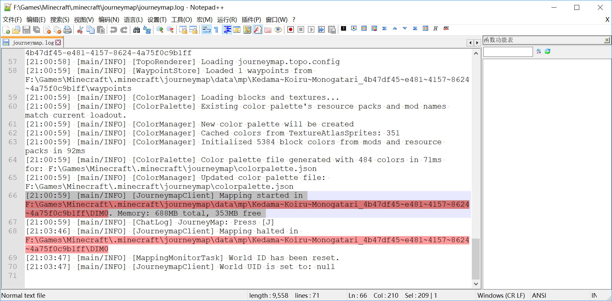
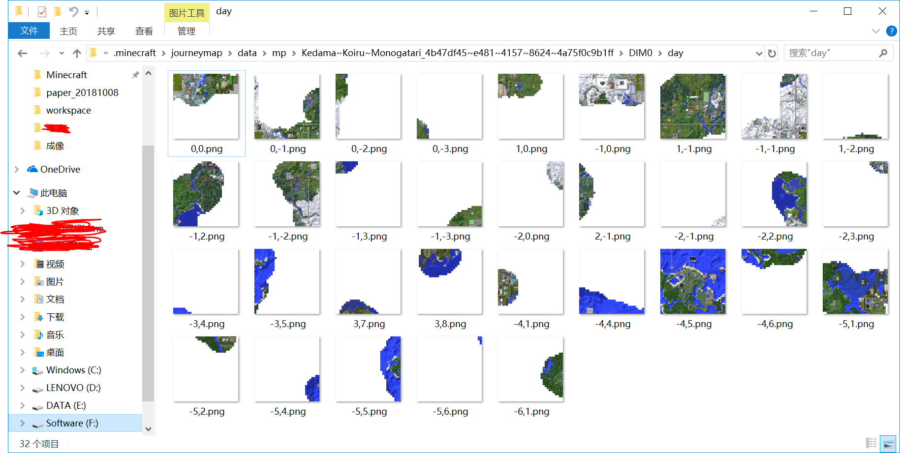

# AlternativeKedamaUnofficialMap

Alternative plan for repo [SilentDepth/KedamaMC-Unofficial-Map](https://github.com/SilentDepth/KedamaMC-Unofficial-Map), using leaflet for display and python-openCV for processing

[毛玉線圈物語 Sunshine (v2) 非官方地图](https://github.com/SilentDepth/KedamaMC-Unofficial-Map) 备用方案，使用leaflet作地图显示，python-openCV处理地图数据

基础图源来自SilentDepth/KedamaMC-Unofficial-Map(赞美鹅叔！)，利用python-openCV进行部分地图更新

### [[github-preview]](https://dwcarrot.github.io/AlternativeKedamaUnofficialMap/view/kedama-map.html)

-----------

## 更新方案
1. 设置`journey map` - `cartography` - (`Show Bathymetry`=TRUE, `Use Transparency`=FALSE)

   验证地图颜色与 [SilentDepth/KedamaMC-Unofficial-Map](https://github.com/SilentDepth/KedamaMC-Unofficial-Map)的相同

   

2. 获取地形信息

3. 寻找对应存储地图文件的文件夹：

   * 可以在`.minecraft/journeymap/journeymap.log`找到当天的日志，或者`.minecraft/logs/XXXX-XX-XX-X.log.gz`找到对应日期的日志，日志中含有地图图片的保存位置信息，例如，下面的日志中记录了journeymap对应地图位置于`.minecraft/journeymap/data/mp/Kedama~Koiru~Monogatari_4b47df45~e481~4157~8624~4a75f0c9b1ff/DIM0`

     

   * 一般来说所需要的文件位于上述文件夹下`day/`文件夹下，例如`.minecraft/journeymap/data/mp/Kedama~Koiru~Monogatari_4b47df45~e481~4157~8624~4a75f0c9b1ff/DIM0/day/`

     

4. 选择所需更新的图片；文件名的坐标`(X,Z)`与实际坐标`(x,z)`满足：$X=floor(x/512), Z=floor(z/512)$,floor表示向下取整函数

5. 联系地图维护者提供图片

> 更新：利用python-opencv 的地图更新工具
>
> ​	还没写完 ε=ε=ε=(~￣▽￣)~