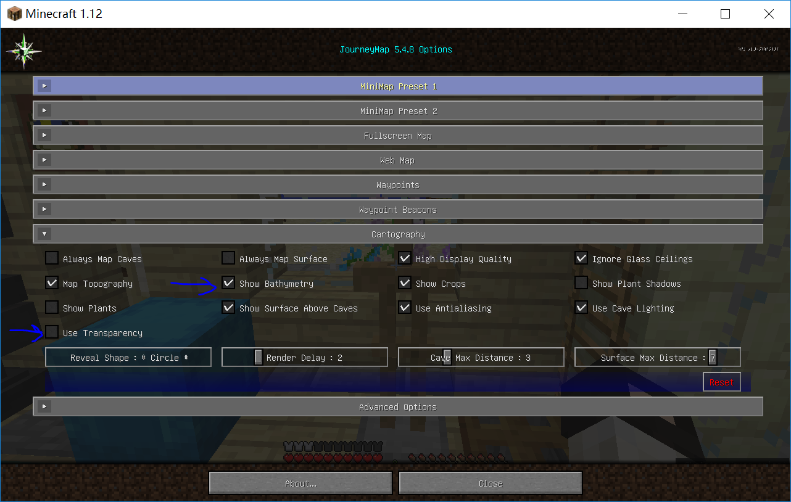
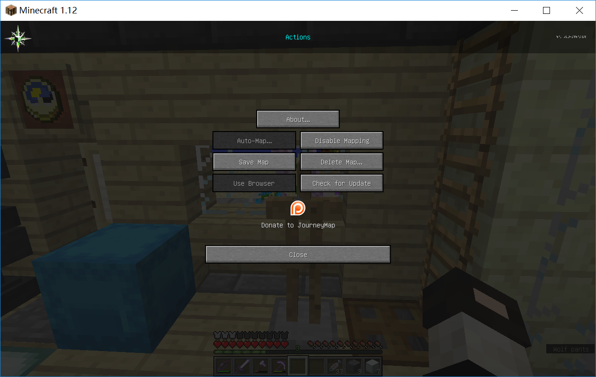
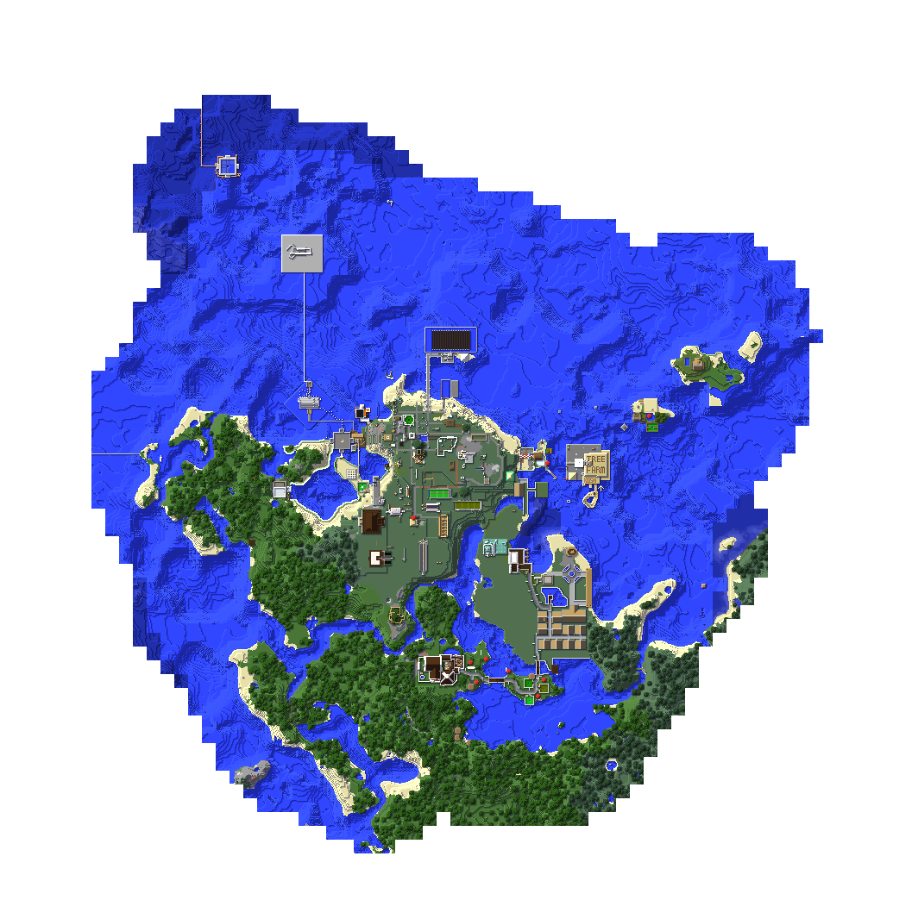

# AlternativeKedamaUnofficialMap

Alternative plan for repo [SilentDepth/KedamaMC-Unofficial-Map](https://github.com/SilentDepth/KedamaMC-Unofficial-Map), using leaflet for display and matlab for processing

[毛玉線圈物語 Sunshine (v2) 非官方地图](https://github.com/SilentDepth/KedamaMC-Unofficial-Map) 备用方案，使用leaflet作地图显示，matlab(app)处理地图数据

基础图源来自SilentDepth/KedamaMC-Unofficial-Map(赞美鹅叔！)，利用mlapp进行部分地图更新

### [[github-preview]](https://dwcarrot.github.io/AlternativeKedamaUnofficialMap/view/kedama-map.html)

### 更新方案
1. 设置`journey map` - `cartography` - (`Show Bathymetry`=TRUE, `Use Transparency`=FALSE)

   验证地图颜色与 [SilentDepth/KedamaMC-Unofficial-Map](https://github.com/SilentDepth/KedamaMC-Unofficial-Map)的相同

   

2. 获取地形信息

3. `journey map` - `Action` - `save image` 导出地图图片

   

4. 提交全部或部分图片，裁剪工具需要保证图片透明性（例如win10 Microsoft Store应用`照片`)

   

> `MapHandler.mlapp`操作：
> 1. 导入主地图，选择视窗；
> 2. 导入更新图，裁剪，选择视窗；
> 3. 进入覆盖模式，移动使更新图与主图坐标对应，退出覆盖模式，检查覆盖后的地图
> 4. 将新生成的地图更新为主地图，并另存为图片
> 5. 自动分割功能：命名格式、最大缩放等级；

